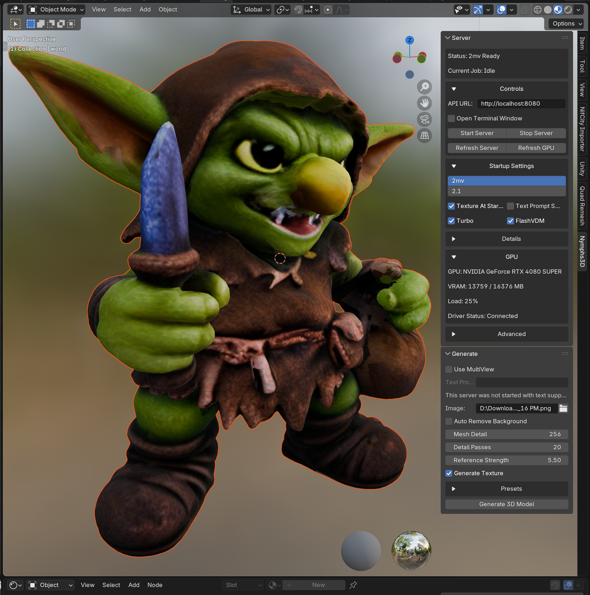

# Nymphs Blender Addon



Nymphs is the Blender frontend for the NymphsCore runtime. It creates image references, turns them into textured meshes, and can retexture selected meshes when a result needs another pass.

## Install From Blender

Use the public extension feed:

```text
https://raw.githubusercontent.com/nymphnerds/NymphsExt/main/index.json
```

Install steps:

1. Open Blender 4.2 or newer.
2. Go to `Edit > Preferences > System > Network` and enable `Allow Online Access`.
3. Go to `Edit > Preferences > Extensions`.
4. Add the remote repository URL above.
5. Refresh remote data if Blender does not load it immediately.
6. Search for `Nymphs` and install it.

The extension id is `nymphs`. This is a new extension identity, not the old `nymphs3d2` id.

## Workflow

1. Generate image references in `Nymphs Image`.
2. Generate the mesh and first texture pass in `Nymphs Shape`.
3. Retexture the selected mesh in `Nymphs Texture` if the first texture needs another pass.
4. Open output folders when you want to inspect saved images, meshes, or metadata.

Start with a single prompt image when the object is simple. Use a front, back, left, and right image set when the shape needs multiple views.

## Image Generation

The `Nymphs Image` panel creates the reference image or multiview set that drives the rest of the workflow.

Image backends:

- `Z-Image`, the default local backend running in the managed runtime
- `Gemini Flash`, using OpenRouter for Nano Banana / Gemini image models

For OpenRouter, paste an API key in the addon field or set `OPENROUTER_API_KEY` in the environment before Blender starts.

Useful image tools:

- prompt and negative prompt fields
- editable JSON prompt presets in `prompt_presets/`
- `Character Part Breakout` for separate body, clothing, weapon, accessory, and prop references from one character description
- generation profiles for size, steps, seed, guidance, and variant count
- four-view multiview generation for front, back, left, and right references
- open and clear buttons for generated image folders

## Shape And Texture Generation

The `Nymphs Shape` panel turns generated image references into a mesh and first texture result, then imports the returned model into Blender.

Single-image path:

1. Start `TRELLIS.2` in `Nymphs Runtimes`.
2. Generate or choose an image.
3. Run shape generation from the `Nymphs Shape` panel.
4. Adjust TRELLIS guidance presets when a prompt needs more or less image adherence.

Multiview path:

1. Create or choose front, back, left, and right reference images.
2. Start `Hunyuan 2mv` in `Nymphs Runtimes`.
3. Send the multiview set from the `Nymphs Shape` panel.
4. Use the imported mesh as the base model for cleanup or texturing.

`Hunyuan 2mv` is intended for cases where multiple aligned views describe the object better than one image can.

## Retexture

The `Nymphs Texture` panel is the optional cleanup pass after shape generation. Use it when the imported mesh is good but the texture needs a different reference image or another pass.

Typical flow:

1. Select a mesh in Blender.
2. Choose a texture reference image.
3. Start `TRELLIS.2` or `Hunyuan 2mv`.
4. Run the texture request and inspect the imported result.

## Runtime

Nymphs uses the managed `NymphsCore` WSL runtime and the `nymph` user created by the Windows Manager.

Use `Nymphs Runtimes` to start, stop, and probe:

- `Z-Image` for local prompt-to-image generation
- `TRELLIS.2` for single-image shape, texture, and retexture work
- `Hunyuan 2mv` for multiview mesh generation from front, back, left, and right images

The retired Hunyuan Parts / P3-SAM / X-Part workflow is no longer included.

## Source Layout

- `Nymphs.py` is the live addon implementation.
- `__init__.py` is the Blender package entrypoint.
- `blender_manifest.toml` defines the Blender extension metadata.
- `prompt_presets/` contains editable packaged prompt presets.
- `scripts/addon_release.py` builds extension zips and refreshes extension feed metadata.

## Build A Test Zip

From `Blender/Addon`:

```bash
python3 scripts/addon_release.py build --output-dir dist
```

The release script packages the addon source, manifest, and prompt presets into a Blender-installable zip.

This addon is part of:

- [nymphnerds/NymphsCore](https://github.com/nymphnerds/NymphsCore)

The public extension feed is:

- [nymphnerds/NymphsExt](https://github.com/nymphnerds/NymphsExt)
