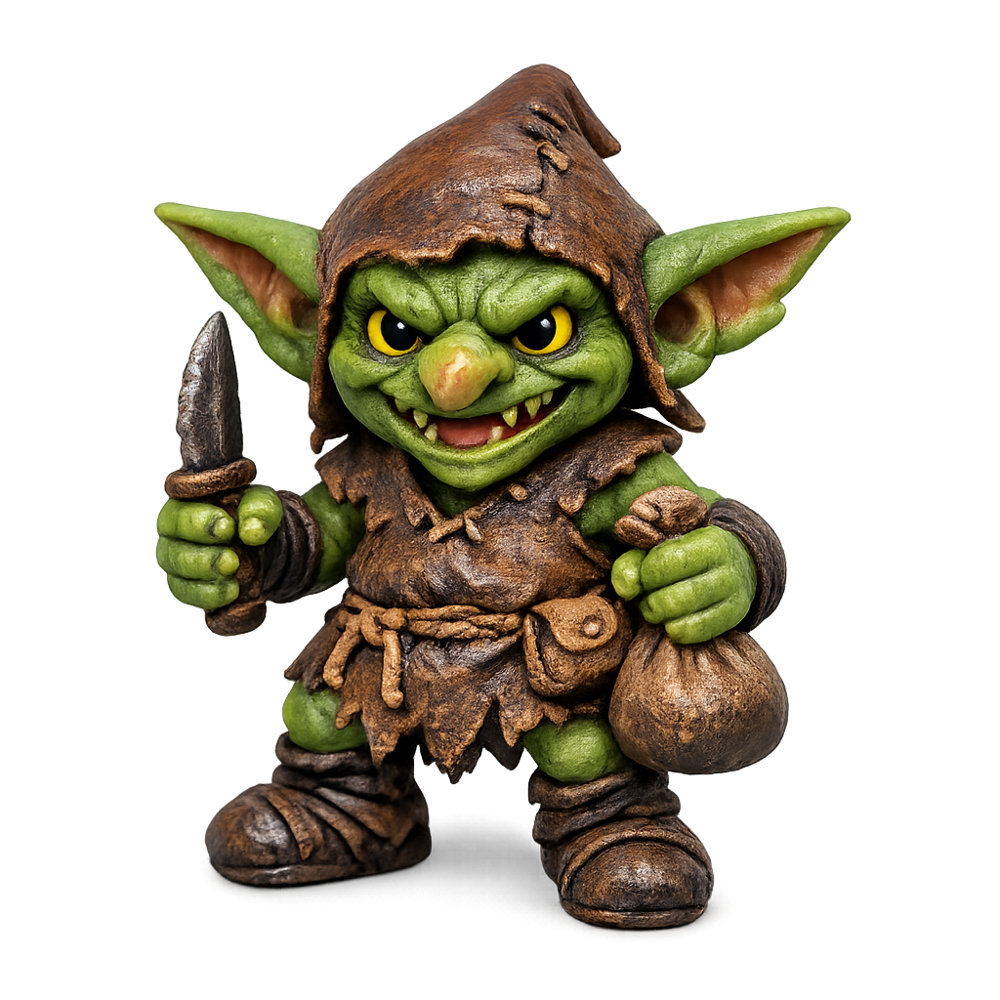

# Goblin: From One Image To 3D

Nymphs3D turns a single reference image into a usable 3D result inside a Blender-first workflow.

## Source

## Generated Shape

## Textured Result

## What This Example Shows

- single-image to 3D generation
- fast local iteration inside Blender
- a workable stylized 3D starting point from one reference image
- optional textured follow-up from the same source

## Nymphs3D

Built for a Blender-first workflow, Nymphs3D gives artists a fast path from 2D reference to editable 3D form on a local machine.
