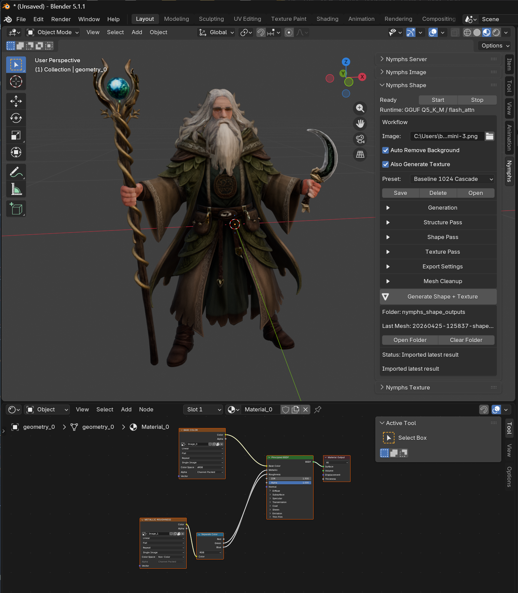

# Nymphs ShapeGuide

This guide follows the Blender addon from top to bottom, starting with the local server and then walking through every `Nymphs Shape` setting in the same order as the UI.

This branch uses the TRELLIS.2 GGUF runtime for shape generation. The older official TRELLIS runtime is not part of this UI path.

## Quick Workflow

1. Open Blender, then open the right sidebar with `N`.
2. Go to the `Nymphs` tab.
3. In `Nymphs Server`, start the TRELLIS.2 runtime.
4. Wait until the Shape panel shows `Ready` and a runtime line such as `GGUF Q5_K_M / flash_attn`.
5. In `Nymphs Shape`, choose a source image.
6. Leave `Auto Remove Background` on for most image-to-3D work.
7. Leave `Also Generate Texture` on if you want a textured GLB.
8. Pick a preset. Start with `Baseline 1024 Cascade`.
9. Click `Generate Shape + Texture`.
10. The addon imports the latest GLB into Blender and records it under `nymphs_shape_outputs`.

## Nymphs Server

The server panel is where the managed local runtimes are started, stopped, and checked.

### Status Box

`Status` shows the overall managed backend state.

Common states:

- `Idle`: no active request is running.
- `Launching`: Blender has asked WSL to start a runtime.
- `Running` or `Ready`: a backend has answered its status probe.
- `Stopping`: Blender is shutting down a managed runtime.

`Runtimes` lists active services. For shape generation you want TRELLIS.2 to be present.

`GPU` shows load and VRAM when the addon can read GPU telemetry.

`Image Backend` belongs to `Nymphs Image`, not Shape, but appears here because the server panel summarizes all managed runtimes.

`Current Job`, `Detail`, and `Progress` mirror the active backend job. During shape generation this is the easiest place to see whether TRELLIS is loading, sampling, exporting, or importing.

### Runtimes

Open `Runtimes` to see the managed backend cards.

Top buttons:

- `Stop All`: stops all managed runtimes launched by the addon.
- `Refresh`: probes the configured backend ports and updates status.

For TRELLIS.2:

- `Start`: launches the TRELLIS.2 GGUF API server.
- `Stop`: stops that runtime.
- `Port`: normally `8094`.
- `Config Details`: expands the detailed runtime settings.

TRELLIS.2 config details:

- `Server Port`: local HTTP port used by Blender. Change only if something else is already using the port.
- `Summary`: live `/server_info` summary from the backend.
- `Current Job`: backend stage for the current request.
- `Detail`: backend detail line, usually model loading or export information.
- `Progress`: progress text reported by the backend.
- `Runtime`: fixed to `GGUF` on this branch.
- `GGUF Quant`: model quantization bundle to load.
- `Repo Path`: local WSL path to the TRELLIS.2 repo.
- `Python Path`: Python executable used to launch TRELLIS.2.

GGUF quant options:

- `Q4_K_M`: smallest local bundle. Use when VRAM is tight.
- `Q5_K_M`: balanced test target and a good default for 16 GB cards.
- `Q6_K`: heavier, higher precision.
- `Q8_0`: largest option. Use only if you have enough VRAM and want to test maximum precision.

### Advanced

Most users do not need this panel after setup.

- `Distro`: WSL distro used for local launch.
- `User`: Linux user inside the WSL distro.
- `Open Terminal Window`: opens a terminal during launch, useful for debugging.
- `API URL`: legacy/general API root display. Shape uses the TRELLIS service port.
- Runtime estimate lines: quick VRAM/runtime guidance for configured backends.
- GPU tools: refresh and display GPU name, VRAM, load, and driver status.

## Nymphs Shape

The Shape panel appears after the TRELLIS runtime is configured. If the runtime is not available, the panel shows the configured runtime and a `Start` / `Stop` row instead of the full generation controls.

At the top:

- `Ready`: the runtime is reachable and shape-capable.
- `Start` / `Stop`: starts or stops the selected 3D service.
- `Runtime`: the loaded TRELLIS runtime summary, for example `GGUF Q5_K_M / flash_attn`.

## Workflow

This box controls the actual input and whether the request also asks for texture.

### Image

The source image sent to TRELLIS. Pick one clear image of the asset, character, prop, building, or creature.

Best inputs:

- single subject
- full object visible
- clean silhouette
- simple or removable background
- no heavy cropping
- no text labels covering the subject
- front or three-quarter views for general assets

Avoid:

- complex scenes
- many overlapping subjects
- extreme perspective
- tiny subject in a large frame
- text-heavy reference sheets
- transparent images with messy edges

### Auto Remove Background

When enabled, the backend removes the background before TRELLIS sees the image.

Leave this on for most generated images, white-background references, character concepts, and product-style renders.

Turn it off only when the background is part of the object information or when background removal is damaging the silhouette.

### Also Generate Texture

When enabled, TRELLIS runs shape and texture in one request and exports a textured GLB.

When disabled, TRELLIS generates a shape-only mesh. The Texture Pass panel disappears because no texture stage will be requested.

Use texture on when:

- you want the imported GLB to include image-based material detail
- you are testing final asset quality
- you want Blender material nodes created on import

Use texture off when:

- you are only testing silhouette
- you want faster iterations
- you need a shape before doing separate texture work

## Preset

Presets set the full TRELLIS recipe: resolution lane, token budget, texture size, face target, cleanup, samplers, and pass settings.

Buttons:

- `Save`: saves the current settings as a user preset.
- `Delete`: deletes the selected user preset.
- `Open`: opens the preset folder.

Built-in presets:

| Preset | Use When | Main Shape |
| --- | --- | --- |
| `Preview 512` | Fast silhouette and crop checks | 512 lane, 512 texture working resolution, 1024 export texture, 250k faces |
| `Baseline 1024 Cascade` | Default first serious run | 1024 cascade, 2K texture export, 500k faces |
| `16GB Safe 1024` | You are near VRAM limits | 1024 cascade, 1024 texture export, 350k faces |
| `Quality 1024` | Baseline looks good and you want a final-looking asset | 1024 cascade, more tokens, more steps, 750k faces |
| `Lowpoly Game Asset` | Lightweight props and real-time previews | 1024 cascade, 1024 texture export, 150k faces |

Recommended starting point:

- Use `Baseline 1024 Cascade`.
- If it runs out of memory, use `16GB Safe 1024`.
- If the silhouette is good and you want more quality, use `Quality 1024`.
- If you are still finding the crop/composition, use `Preview 512`.

## Generation

Generation controls the broad request: resolution lane, repeatability, detail budget, image prep, and global sampler.

### Resolution

Selects the TRELLIS pipeline lane.

- `512`: fastest verified shape/texturing lane. Best for previews.
- `1024`: direct 1024 lane.
- `1024 Cascade`: default higher-detail GGUF shape lane. Best baseline.
- `1536 Cascade`: experimental higher-detail lane. Heavier and more likely to hit VRAM limits.

Practical advice:

- Start with `1024 Cascade`.
- Use `512` when you are checking image suitability.
- Treat `1536 Cascade` as experimental.

### Seed

Optional numeric seed.

- Blank means random.
- A number makes the result more repeatable.
- Reusing a seed helps compare settings without changing everything at once.

If a result is close but not quite right, keep the seed and adjust one setting. If the result is fundamentally wrong, clear or change the seed.

### Tokens

`Tokens` is the detail budget TRELLIS can keep while building the scene.

- Higher values can preserve more structure.
- Higher values cost more VRAM and time.
- Lower values are safer for memory but may simplify thin detail.

Typical ranges:

- `49152`: safe baseline.
- `65536`: quality preset territory.
- higher values: experimental and VRAM-heavy.

### Foreground

GGUF image-prep crop/padding ratio.

- Lower values crop tighter around the subject.
- Higher values keep more surrounding image area.

Default is `0.85`.

Use lower values if:

- the subject is small in frame
- extra background is being treated as geometry

Use higher values if:

- the crop cuts off clothing, weapons, ears, horns, wings, or other outer details

### Sparse Res

Sparse structure grid resolution.

- `Auto`: use the runtime default.
- `32`: lighter and usually faster.
- `64`: heavier and experimental, can preserve more broad structure.

Leave this on `Auto` unless you are testing structure problems.

### Global Sampler

GGUF sampler override used as the broad default.

- `Default`: use the sampler from the loaded TRELLIS pipeline config.
- `Euler`: Euler flow sampler.
- `Heun`: GGUF-only Heun sampler.
- `RK4`: fourth-order Runge-Kutta sampler.
- `RK5`: fifth-order Runge-Kutta sampler.

Stage-specific samplers in `Structure Pass`, `Shape Pass`, and `Texture Pass` override the global sampler for that stage.

Recommendation: leave `Global Sampler` on `Default` while comparing presets.

## Structure Pass

The Structure Pass is the early coarse stage. It decides broad volume, silhouette, major body layout, and large spatial relationships before the main Shape Pass refines the mesh.

Most users should leave this panel closed and rely on presets.

### Sampler

Sampler override for the coarse structure pass.

Use this only when testing sampler behavior. `Default` is the safest baseline.

### Steps

How long TRELLIS spends on the coarse structure pass.

- More steps can stabilize broad form.
- Fewer steps are faster.
- Too many steps can over-commit to early mistakes.

Baseline default is `12`; `Quality 1024` uses `14`.

### Image

This is structure guidance strength: how strongly the coarse pass follows the source image.

- Higher values force the rough layout closer to the image.
- Lower values allow more interpretation.

Default is `7.5`.

### Rescale

Softens overly strong guidance in the structure pass.

Default is `0.7`.

Raise it if structure guidance feels harsh or unstable. Lower it if guidance feels too weak.

### Start / End

Controls the interval where image guidance is active during the structure pass.

Defaults:

- `Start`: `0.6`
- `End`: `1.0`

Leave these alone unless you are deliberately tuning the diffusion schedule.

### Timing

Expert timing control for the structure pass.

Default is `5.0`.

Leave it at the preset value unless you are doing controlled comparisons.

## Shape Pass

The Shape Pass is the main 3D refinement stage. It affects detailed geometry, silhouette cleanup, and how closely the mesh follows the source image after the coarse structure is established.

### Sampler

Sampler override for the main shape pass.

`Default` is recommended for normal use.

### Steps

How long TRELLIS spends refining the main shape.

- Higher values are slower.
- Higher values can improve stability and detail.
- Very high values can waste time if the source image is poor.

Baseline default is `12`; `Quality 1024` uses `16`.

### Image

Shape guidance strength.

- Higher values stick closer to the source image.
- Lower values allow more model interpretation.
- Too high can make shapes brittle or over-constrained.

Default is `7.5`.

### Rescale

Softens strong guidance in the main shape pass.

Default is `0.5`.

If the mesh looks forced, jagged, or unstable, increasing rescale may help. If the shape ignores the source, lowering rescale or increasing Image guidance may help.

### Start / End

Controls when guidance is active in the main shape pass.

Defaults:

- `Start`: `0.6`
- `End`: `1.0`

Leave these at preset values for normal work.

### Timing

Expert timing control for the main shape pass.

Default is `3.0`.

## Texture Pass

This panel appears only when `Also Generate Texture` is enabled.

The Texture Pass paints the generated shape from the source image and then prepares texture data for export.

### Working Res

Internal TRELLIS texture working resolution.

- `512 px`: lightest texture mode.
- `1024 px`: balanced default.
- `1536 experimental`: higher operating resolution using the 1024 texture model path.

Use `1024 px` for most runs. Use `512 px` for memory safety. Treat `1536` as experimental.

### Sampler

Sampler override for the texture pass.

Leave this on `Default` unless you are testing texture stability.

### Steps

How long TRELLIS spends refining textures.

- Higher values are slower.
- Higher values can improve texture stability.

Baseline default is `12`; `Quality 1024` uses `16`.

### Image

Texture guidance strength.

- Higher values stick closer to the source image.
- Lower values allow more variation.

Default is `1.0`; `Quality 1024` uses `1.25`.

Texture guidance is intentionally much lower than shape guidance. Large values can overbake source-image artifacts.

### Rescale

Softens strong texture guidance.

Default is `0.0`.

Most users should leave this alone.

### Start / End

Controls when texture guidance is active.

Defaults:

- `Start`: `0.6`
- `End`: `0.9`

Leave these at preset values for normal work.

### Timing

Expert timing control for texture sampling.

Default is `3.0`.

## Export Settings

Export Settings control the final GLB: texture map size, remeshing, material options, UVs, and target face count.

### Texture Size

Final exported texture-map size.

Shown only when `Also Generate Texture` is enabled.

- `1024 px`: lower VRAM, faster export, lighter files.
- `2048 px`: balanced default.
- `4096 px`: heavier export with more map detail.

Use `2048 px` for most assets. Use `1024 px` for previews or 16 GB safety. Use `4096 px` only when the source image and geometry justify it.

### Remesh Export

Uses o-voxel remeshing during textured GLB export.

Can improve topology, but may slightly change silhouettes.

Default is on.

### Band

o-voxel remesh band width for textured export.

Default is `1.0`.

Higher values can be more forgiving but may soften detail. Lower values can preserve tighter surfaces but may be less robust.

### Project

How strongly remeshed vertices project back to the original surface.

Default is `0.0`.

Raise carefully if remesh loses too much shape fidelity.

### Alpha

Texture material alpha mode.

- `Opaque`: force opaque material. Best default for most assets.
- `Blend`: blended transparency.
- `Mask`: alpha clipping/masking.

Use `Opaque` unless you are deliberately working with transparency.

### Double Sided

Writes textured materials as double-sided where supported.

Default is on.

Useful for thin cloth, cards, leaves, hair-like cards, or imperfect mesh backsides.

### UV Method

UV unwrap method.

- `Xatlas`: default and recommended.
- `Smart`: backend Smart UV path if available.
- `Blender`: backend Blender unwrap path if available.

Use `Xatlas` unless you are debugging UV layout.

### UV Angle

UV chart cone angle in degrees.

Default is `60.0`.

Lower values can create more UV islands. Higher values can create broader islands. Leave this alone unless you see UV stretching or bad charting.

### Inpaint

Texture padding/inpainting method.

- `Telea`: OpenCV Telea inpainting. Default.
- `Navier-Stokes`: OpenCV Navier-Stokes inpainting.

This affects how texture padding fills gaps around UV islands.

### Bake Vertices

Bakes color data onto vertices instead of only texture maps where supported.

Default is off.

Use only when you specifically want vertex color data or are testing an export path that benefits from it.

### Custom Normals

Preserves or writes custom normals during postprocess where supported.

Default is off.

Enable only if you are testing normal behavior or a downstream tool needs custom normals.

### Faces

Target face count after simplification.

- Lower values export lighter meshes.
- Higher values keep more geometry.

Preset examples:

- `150000`: lowpoly game asset.
- `250000`: preview.
- `350000`: 16 GB safe.
- `500000`: baseline.
- `750000`: quality.

If Blender feels heavy after import, lower `Faces`. If fine silhouette details are being lost, raise it.

## Mesh Cleanup

Mesh Cleanup appears for the GGUF runtime. It controls shape-only export behavior and cleanup of accidental flat debris.

### Shape Export

Shape-only export mode.

- `Preserve`: raw GGUF mesh export with Blender orientation.
- `Remesh`: rebuild topology with the GGUF remesh path.
- `Auto Fallback`: try Preserve first, then fall back to Remesh if export fails.

Default is `Auto Fallback`.

Use `Preserve` when you want the rawest output. Use `Remesh` when topology is problematic. Use `Auto Fallback` for normal operation.

### Remesh Res

GGUF remesh grid resolution for shape-only remesh export.

- `512`: faster, lighter remesh.
- `768`: balanced default.
- `1024`: denser, slower, heavier.

Shown when `Shape Export` is `Remesh` or `Auto Fallback`.

### Remove Flat Debris

Removes accidental wide, flat base-plane components from GGUF shape-only exports.

Default is on.

Leave it enabled if you are seeing floor sheets, background plates, or flat generated debris. Turn it off only if the object itself has legitimate broad flat surfaces that are being removed.

## Generate Button

The main button changes label depending on texture:

- `Generate Shape + Texture`: texture is requested.
- `Generate Shape`: shape-only request.

When clicked, the addon:

1. Reads the source image.
2. Applies the selected workflow settings.
3. Sends the image and TRELLIS settings to the local GGUF backend.
4. Waits for structure, shape, texture, and export stages as requested.
5. Copies the result into Blender's local output folder.
6. Imports the latest GLB into the scene.
7. Records the output path in the result box.

## Output Box

After a successful run, the panel shows:

- `Folder`: normally `nymphs_shape_outputs`.
- `Last Mesh`: the latest generated GLB filename.
- `Open Folder`: opens the output folder.
- `Clear Folder`: clears generated shape outputs and resets the recorded latest mesh.
- `Status`: final import or error status.

The imported mesh is a GLB. When texture generation is enabled, Blender should also create material nodes using the generated texture maps.

## Good Baseline Recipes

### First Serious Run

- Preset: `Baseline 1024 Cascade`
- Auto Remove Background: on
- Also Generate Texture: on
- Seed: blank
- Leave all pass panels closed

Use this when you trust the source image.

### Fast Composition Check

- Preset: `Preview 512`
- Auto Remove Background: on
- Also Generate Texture: off or on depending on what you are checking
- Faces: leave preset value

Use this before spending time on high-detail settings.

### 16 GB Safety

- Preset: `16GB Safe 1024`
- Texture Size: `1024 px`
- Avoid `1536 Cascade`
- Avoid `4096 px` textures
- Keep Tokens at preset value

Use this when the backend loads but jobs fail during sampling or export.

### Better Final Pass

- Preset: `Quality 1024`
- Use only after the baseline has a good silhouette
- Keep the same Seed if you are comparing quality

Use this when the shape is already close and you want a cleaner, richer result.

## Troubleshooting

### The Shape Panel Only Shows Start/Stop

The TRELLIS runtime is not available yet.

Do this:

1. Open `Nymphs Server`.
2. Expand `Runtimes`.
3. Start TRELLIS.2.
4. Wait for `Ready`.
5. Click `Refresh` if the backend is already running.

### The Mesh Has a Floor Sheet or Background Plate

Try:

- Keep `Auto Remove Background` on.
- Keep `Remove Flat Debris` on.
- Lower `Foreground` if too much background is kept.
- Use a cleaner image with a plain background.

### The Subject Is Cropped

Try:

- Increase `Foreground`.
- Use an image with more padding.
- Avoid source images where hands, weapons, horns, tails, or feet touch the edge.

### The Shape Ignores Fine Details

Try:

- Use `Baseline 1024 Cascade` or `Quality 1024`.
- Increase `Faces`.
- Increase `Tokens` only if you have VRAM headroom.
- Use a clearer source image before tuning advanced pass settings.

### The Run Fails Near Export

Try:

- Use `16GB Safe 1024`.
- Lower `Texture Size`.
- Lower `Faces`.
- Use `Preview 512` to confirm the image is usable.
- Restart the TRELLIS runtime if memory is fragmented after several heavy runs.

### Texture Looks Smeared

Try:

- Use a higher-quality source image.
- Use `Texture Size` `2048 px`.
- Increase `Texture Steps` modestly.
- Avoid extreme source-image shadows or busy backgrounds.

### Blender Import Is Heavy

Try:

- Lower `Faces`.
- Use `Lowpoly Game Asset`.
- Use `Texture Size` `1024 px`.

## Best Practice

The easiest way to tune TRELLIS is to change one thing at a time.

Start with a preset, get a baseline, then adjust only the setting that matches the failure:

- wrong crop: `Foreground`
- too much background geometry: `Auto Remove Background`, `Foreground`, `Remove Flat Debris`
- weak silhouette: `Resolution`, `Shape Steps`, `Shape Image`
- texture too light or loose: `Texture Steps`, `Texture Image`, `Texture Size`
- file too heavy: `Faces`, `Texture Size`, preset choice
- memory failure: safer preset, lower texture size, lower faces

Most good results come from a clean input image plus the right preset, not from opening every advanced panel at once.
